# Nextcloud Yaga - Yet Another Gallery App

## Table of Contents
* [State of Yaga](#state-of-yaga)
    * [Features](#features)
    * [Next Steps](#next-steps)
* [Getting Started](#getting-started)
* [Recomendations](#recomendations)
* [iOS Support](#ios-support)
    * [Necessary work](#necessary-work)

## Gallery

   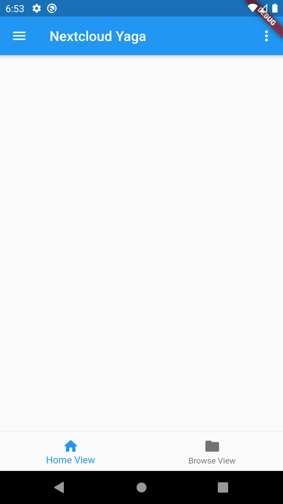
   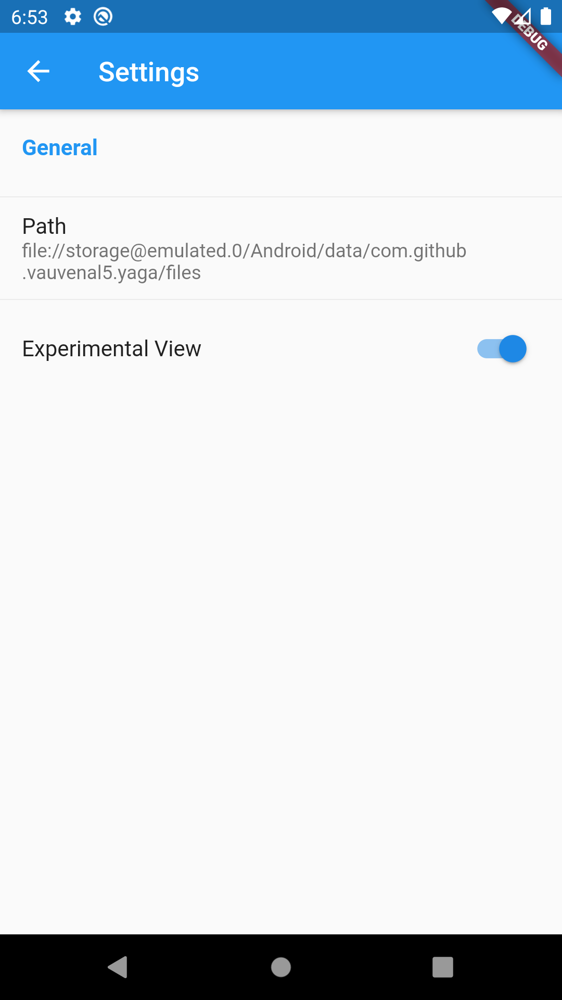
   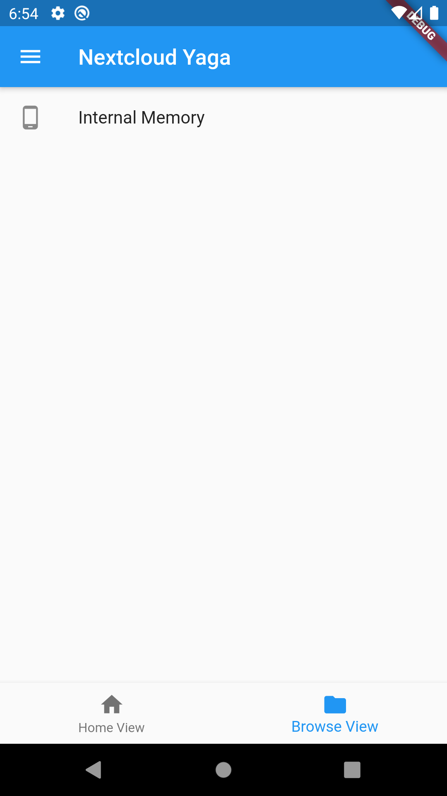
   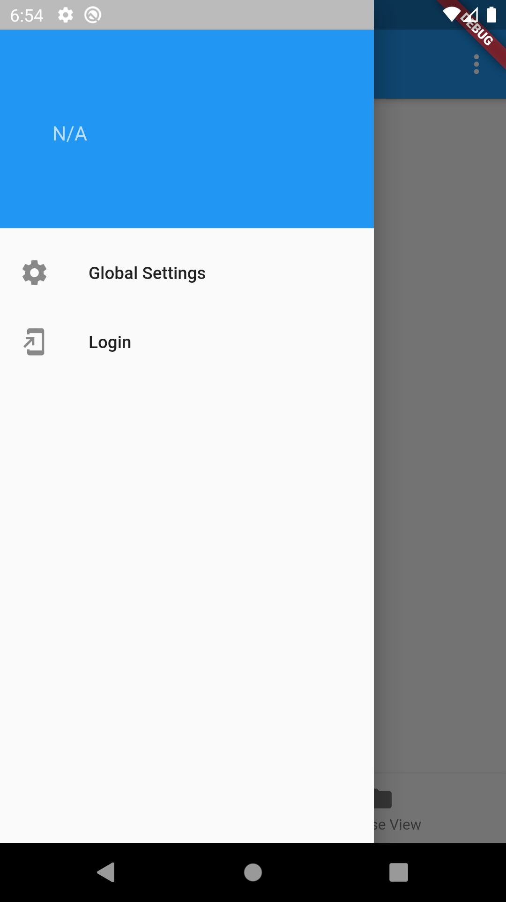
   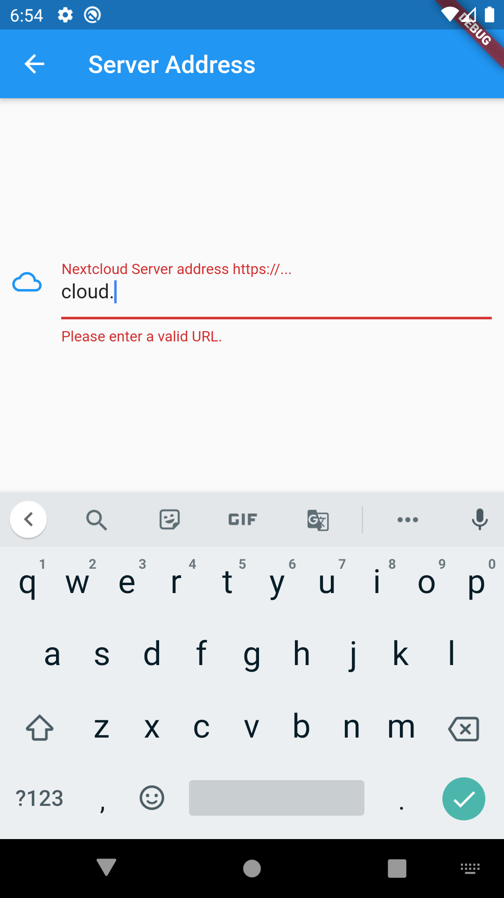
   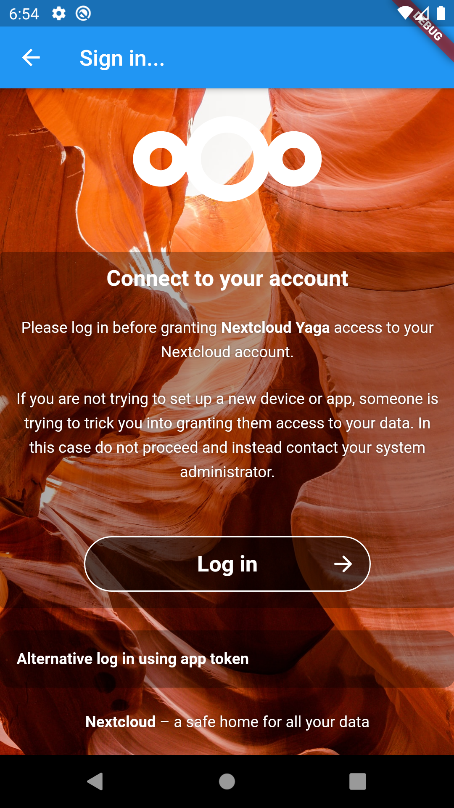
   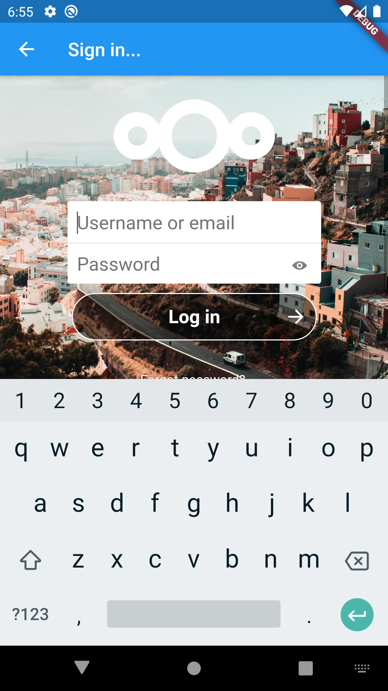
   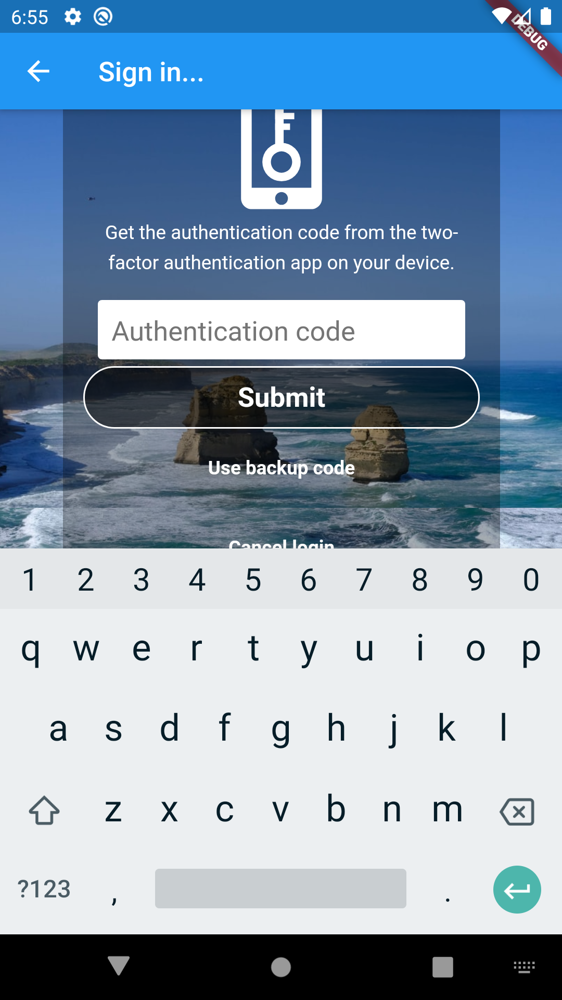
   
   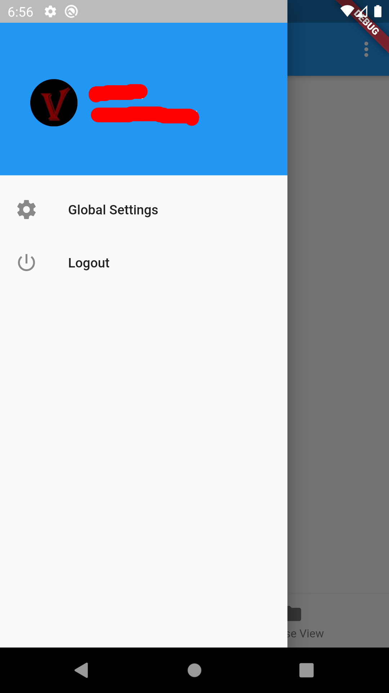
   
   
   
   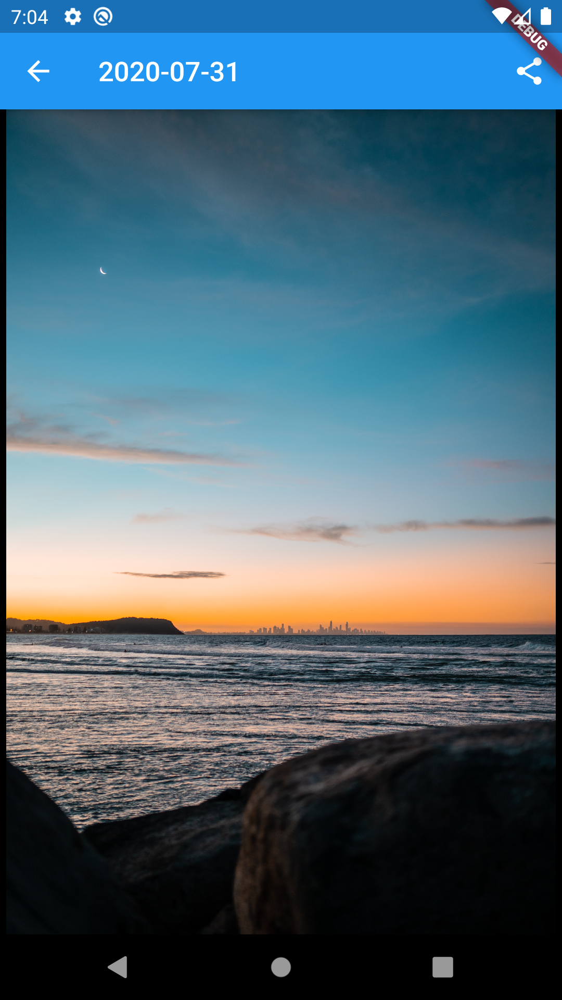
   
   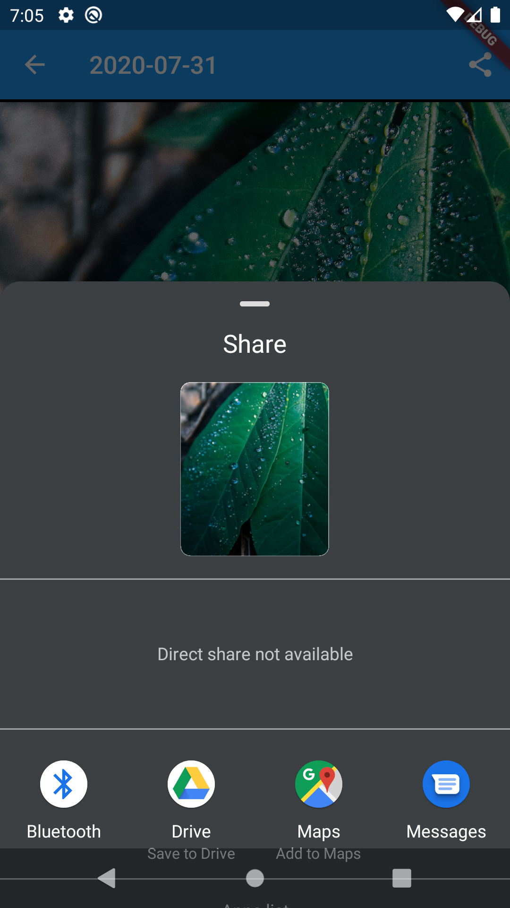
   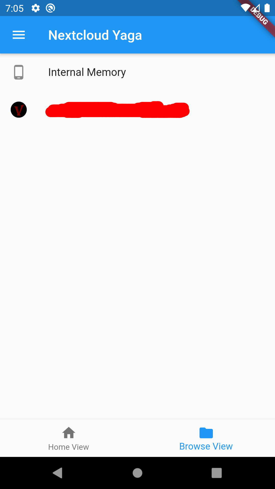
   
   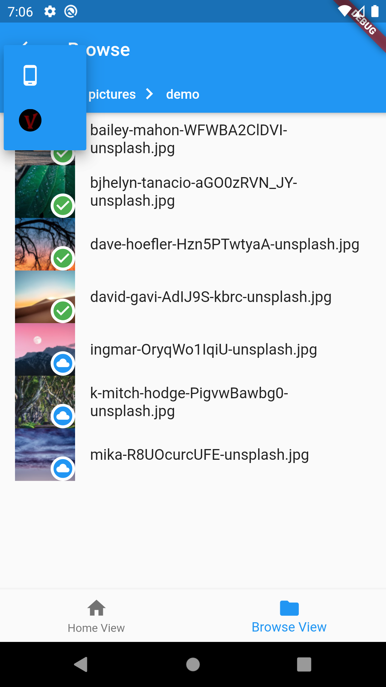
   
   

## State of Yaga

This app is in an early alpha stage. It is tested and fairly stable on an Android One device with Android version 10.

### Features
- Nextcloud login flow is implemented
    - Flutter WebView itself is in an early stage and errors can occure while in the webview. However simply retrying usually fixes the issue.
    - Login token is being persisted with the `flutter_secure_storage` plugin.
- Category view
    - Displays images in groups sorted by date modified.
    - Path to display can be set in the view settings.
    - Path can be local or remote.
- Browse view
    - Allows for browsing local and remote directories.
- Image view
    - Opening an image from the category or browse view will result in a image view, displaying the image.
    - If opened from category view, displayed images are currently limited to the choosen date.
    - If opened from browser view, displayed images are limited to the current folder.
    - Images can be shared with other apps from this view.
- Root Mapping
    - Allows to set directory mappings between local and remote directories. Basically allowing you to chose where to store your downloaded images or a subset of them.
    - Default mapping points to app folder.
    - Currently limited to one mapping.
    - Previews are always mapped to cache.

### Next Steps
The following things are on my roadmap and will be developed during the next months, however, not necessarily in this order.
- [ ] Improve autmated test coverage.
- [ ] Clean up code base.
- [ ] Add favourite places to browse view.
- [ ] **Publish on F-Droid.**
- [ ] Allow for moving/deleting images.
- [ ] Multiselect.
- [ ] **Improve readme. (add screenshots)**
- [ ] Move long running tasks into background.
- [ ] Local/Remote search.

## Getting Started

- Generate your own keystore as described in the flutter docs.
- From the main directory run: `flutter build apk --flavor local`
- Copy the app to your device and make a local installation.

## Recomendations

It is highly recommended to configure the image preview generator plugin on your Nextcloud server. This will significantly improve fetching times of previews.

## iOS Support

I am physically unable to support iOS. I simply do not own the hardware and I also do not intend buying it. If Apple changes its policies about development SDKs I will gladly add iOS support.

If somebody is willing to contribute the necessary steps for iOS support fell free to open a PR. 

### Necessary work
- It will be necessary to recheck the used libraries to see if they support iOS. (This I might do at some point in the future.)
- Some things rely on Android only implementations, for example the storage paths. They need to be changed to a OS independent implementation. (This I might do at some point in the future.)
- Necessary build configuration in the iOS project files. (Not going to happen for the time being.)
- Publishing in the app store. (Not going to happen for the time being.)
